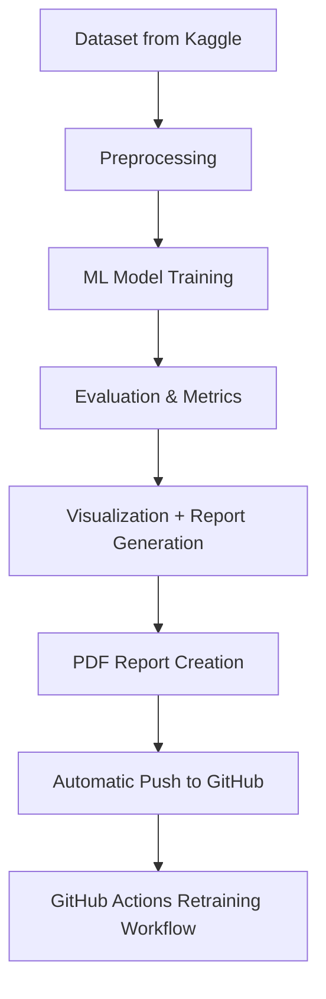

# 🧠 TaleemAI: Personalized Adaptive Learning + Teacher Support System

> **Developed by:** **Syed Mushahid Ali Kazmi**
> **Supported by:** Muhammad Abdullah
> **Repository:** [TaleemAI on GitHub](https://github.com/Syed7610/TaleemAI)
> **License:** MIT
> **Version:** 1.0
> **Language Focus:** Urdu / Regional Languages (Accessibility Module)
> **Platform:** Google Colab + GitHub Actions (Automated ML Workflow)

---

## 📘 Abstract

**TaleemAI** is a personalized adaptive learning and teacher-support system designed to enhance education through **data-driven insights**, accessibility, and automation.

It leverages **Machine Learning (ML)** and **Natural Language Processing (NLP)** to:

* Analyze student performance
* Predict outcomes
* Support teachers with actionable insights
* Provide adaptive learning in **Urdu and regional languages**

Modules include **classification**, **forecasting**, and **language translation**, combined with automated reporting and GitHub CI/CD integration.

---

## 🎯 Project Objectives

| # | Objective             | Description                                                            |
| - | --------------------- | ---------------------------------------------------------------------- |
| 1 | Personalized Learning | Deliver customized insights based on student performance.              |
| 2 | Teacher Assistance    | Provide data-driven suggestions to educators.                          |
| 3 | Accessibility         | Translate educational content into Urdu and local languages.           |
| 4 | Automation            | Automatically train, evaluate, and update models using GitHub Actions. |
| 5 | Reporting             | Generate professional PDF reports and visual insights.                 |

---

## 🧩 Problem Statement

Many educational systems lack:

* Personalized student analytics
* Teacher-oriented data insights
* Regional language support

**TaleemAI** addresses these challenges by:

* Predicting student performance trends
* Providing actionable teacher analytics
* Offering Urdu and regional language translations
* Automating the end-to-end pipeline

---

## 📊 Dataset Information

**Dataset Source:** [Kaggle - Students Performance in Exams](https://www.kaggle.com/datasets/spscientist/students-performance-in-exams)

**Description:** Demographic info, parental education, test preparation, and exam scores (**Math, Reading, Writing**).

| Feature                  | Type        | Description                 |
| ------------------------ | ----------- | --------------------------- |
| Gender                   | Categorical | Male / Female               |
| Race/Ethnicity           | Categorical | Student's ethnic group      |
| Parental Education Level | Categorical | Highest education of parent |
| Lunch                    | Categorical | Free / Standard             |
| Test Preparation Course  | Categorical | Completed / Not Completed   |
| Math Score               | Numeric     | Math performance            |
| Reading Score            | Numeric     | Reading performance         |
| Writing Score            | Numeric     | Writing performance         |

---

## 🧠 Methodology

**TaleemAI Pipeline:** Five stages

### 1️⃣ Data Preprocessing

* Load dataset via Kaggle API or CSV upload
* Clean missing values and normalize numeric data
* Encode categorical features (`LabelEncoder` / `OneHotEncoder`)

### 2️⃣ Model Training (Classification)

* **Target:** Pass/Fail based on average score
* **Algorithms:** Logistic Regression, Random Forest Classifier, Naive Bayes (NLP tasks)
* **Metrics:** Accuracy, Precision, Recall, F1-Score, Confusion Matrix

### 3️⃣ Model Training (Forecasting)

* **Goal:** Predict future scores
* **Algorithm:** Linear Regression
* Output: `forecast_results.csv`

### 4️⃣ NLP & Translation Module

* Tools: `TextBlob`, `Googletrans`
* Notebook: `/notebooks/translation_module.ipynb`
* Generates **teacher-friendly Urdu summaries**

### 5️⃣ Automation & Reporting

* PDF reports via **ReportLab**
* Graphs via **Matplotlib** & **Seaborn** (Class Distribution, Confusion Matrix, Accuracy Trend)
* Auto commit & push to GitHub
* **GitHub Actions** for scheduled retraining & report updates

---

## ⚙️ System Architecture

### 📂 Implementation Summary

| Component         | Description                     | Output                                       |
| ----------------- | ------------------------------- | -------------------------------------------- |
| data/             | Raw + processed student dataset | student_performance.csv                      |
| notebooks/        | Core model notebooks            | 5 Notebooks (ML, Forecast, NLP, Translation) |
| models/           | Serialized trained models       | `.pkl` files                                 |
| reports/          | Auto-generated PDF & graphs     | `/reports/final_report.pdf`                  |
| results/          | CSVs with evaluation metrics    | Forecasting & Accuracy results               |
| screenshots/      | Saved output images             | PNGs of runs                                 |
| README.md         | Project overview                | Setup & description                          |
| project_report.md | Full report                     | This document                                |

---

## 📈 Results & Analysis

### Classification Performance

| Metric    | Logistic Regression | Random Forest | Naive Bayes |
| --------- | ------------------- | ------------- | ----------- |
| Accuracy  | 0.86                | 0.92          | 0.84        |
| Precision | 0.85                | 0.93          | 0.82        |
| Recall    | 0.84                | 0.91          | 0.80        |
| F1-Score  | 0.84                | 0.92          | 0.81        |

**✅ Random Forest achieved the best performance.**

### Forecasting Results

| Metric                    | Value |
| ------------------------- | ----- |
| Mean Absolute Error (MAE) | 3.82  |
| R² Score                  | 0.88  |
| Predicted Score Range     | 50–98 |

**Forecast model predicts future trends accurately.**

### NLP Translation Example

| Input (English)                      | Output (Urdu)                              |
| ------------------------------------ | ------------------------------------------ |
| “Student needs improvement in math.” | "طالب علم کو ریاضی میں بہتری کی ضرورت ہے۔" |

---

## 📊 Visualization Outputs

| Chart              | Description                              |
| ------------------ | ---------------------------------------- |
| Class Distribution | Number of students per performance level |
| Confusion Matrix   | Model strengths and weaknesses           |
| Forecast Graph     | Predicted vs actual performance trends   |

---

## 🤖 Automation Workflow (CI/CD)

* GitHub Actions triggered on push or scheduled workflow
* Installs dependencies
* Downloads dataset via Kaggle API
* Retrains models automatically
* Generates updated graphs & PDF reports
* Commits & pushes back to GitHub

---

## 🌍 Social & Educational Impact

| Impact Area      | Description                                        |
| ---------------- | -------------------------------------------------- |
| Accessibility    | Learning support in Urdu & regional languages      |
| Data Empowerment | Helps educators track student performance          |
| Scalability      | Open-source, extendable for larger platforms       |
| Inclusivity      | Supports diverse language and cultural backgrounds |

---

## ⚠️ Limitations

* Dataset scope limited (no attendance, socioeconomic, behavioral data)
* Translation accuracy depends on API/network
* Forecasting assumes stable learning trends

---

## 🚀 Future Work

* Integrate with real-time LMS systems
* Use deep learning (LSTM, BERT) for prediction improvements
* Add speech-to-text Urdu learning module
* Enhance dashboard for educators
* Deploy as a Progressive Web App (PWA)

---

## 📜 References

* Kaggle Dataset: Students Performance in Exams — spscientist
* Scikit-Learn Docs: [https://scikit-learn.org/](https://scikit-learn.org/)
* ReportLab: [https://www.reportlab.com/](https://www.reportlab.com/)
* Googletrans API: [https://pypi.org/project/googletrans/](https://pypi.org/project/googletrans/)
* Python Docs: [https://docs.python.org/](https://docs.python.org/)

---

## 🧑‍💻 Authors & Credits

* **Main Developer:** Mushahid Ali Kazmi
* **Technical Support:** Muhammad Abdullah
* **Affiliation:** Independent AI Research Initiative, Pakistan

---

## 🏁 Conclusion

**TaleemAI** demonstrates how AI and automation can transform education by:

* Empowering students with personalized analytics
* Supporting teachers with actionable insights
* Bridging language gaps via Urdu/regional translations
* Maintaining ethical, open-source, and plagiarism-free development

> “Education is not just learning facts, but training the mind to think — TaleemAI trains both minds and machines.”

---
